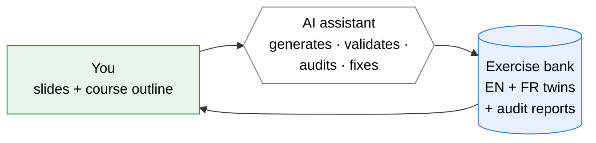

# quiz-llm-bank

An open-source helper that turns your **lecture slides** into a validated,
**bilingual exercise bank** for your course — without you writing any code.

You provide the materials. An AI assistant (Claude, Codex, or a similar
coding agent) drives the toolchain inside this repo.

The current implementation ships **bilingual** generation (one primary
language plus one twin language). The configuration accepts more than
two languages, but only the bilingual case has been wired through end
to end and tested.

---

## What this is for

You are a course instructor. You have lecture slides (PDF, PPTX, or
markdown). You want a structured pool of practice questions students can
work through — in the same language as your lectures, plus a bilingual
twin if you teach in more than one language.

Hand-writing 100+ exercises per course is slow and tedious. This repo
contains a generator that does it for you, with three guardrails baked in:

1. Exercises stay **inside the topics each session actually covers** — no
   exercise about a method you haven't taught yet.
2. Every exercise is **double-checked** by an independent verifier before
   it's shown as "ready". The verifier may use the same model as generation,
   but it must run in a separate fresh-context agent/session.
3. Mistakes are **caught and fixed automatically** — and when an exercise
   is in the wrong session, it's moved to the right one rather than thrown
   away.

You don't need to know Python, JSON, or anything else technical. The
assistant reading this repo does.

---

## What you'll need

- An **AI coding assistant** that can read this folder and run commands.
  Any of these work:
  - [Claude Code](https://claude.ai/download) (recommended — the
    instructions in `CLAUDE.md` are tuned for it)
  - [Codex CLI](https://github.com/openai/codex)
  - ChatGPT or Claude.ai with the repo content pasted in (less smooth, but
    works for one-off help)
- Your **course materials**: slides for each session, ideally as markdown
  or PDF.
- A **course outline**: which sessions cover what, in what order. Don't
  worry about format — the assistant will ask you.

That's it. No Python install, no command-line work, no JSON editing. The
assistant handles all of that.

---

## How to use it

### Step 1: Open the repo with your AI assistant

Clone or download this repo, then open the folder with Claude Code (or
your assistant of choice).

### Step 2: Say what you want

A first message like:

> *"I'd like to set up a new exercise bank for my course. Walk me
> through it."*

is enough. The assistant will read this README, the file `CLAUDE.md` (its
own internal instructions), and start asking you what it needs:

- What's the course name?
- How many sessions, and what does each cover?
- What language(s) — one, two, more?
- Where are your slides?

You can drop your slides into the `inbox/` folder when prompted (the
assistant will tell you how — see [`inbox/README.md`](inbox/README.md)
for details if you want to look ahead).

### Step 3: Let it run

Once it has the inputs, the assistant will:

1. Ask Claude/Codex to **generate** the exercises, session by session,
   in batches.
2. Run a set of **automated checks** (math correctness, format, twin
   parity, scope, etc.).
3. Run an **independent audit** in a fresh verifier context that flags
   exercises with quality issues or that drift outside their session's topic.
4. **Fix or relocate** the flagged exercises automatically.
5. Show you the result.

This step takes time (several minutes per session, depending on session
size and your LLM rate limits). You don't need to watch — when it's
done, the assistant will summarize what was produced.

### Step 4: Review and use

The output goes into a folder called `output/<your_course_id>/`, with one
file per session per language. You can:

- Read the exercises directly as markdown (each JSON file is human-readable).
- Browse the auto-generated catalog (`EXERCISE_BANK_CATALOG.md`) for an overview.
- Drop the folder into a downstream chat widget or LMS that accepts the
  same format.

If you want to tweak something — change a question, change difficulty,
remove an exercise — just tell the assistant. It knows how.

---

## See an example before you commit

The folder [`examples/econometrics/`](examples/econometrics/) contains a
**single end-to-end run** of the pipeline on an introductory econometrics
course (English + French, 3 sessions, 60 exercises total). It's a sample
of what the pipeline produces, **including the audit findings the
reviewers flagged** — some of which are intentionally left unfixed in
the bundle so you can see what the audit catches.

Read [`examples/econometrics/README.md`](examples/econometrics/README.md)
for what's there, what state the bank is in, and how to reuse the
configuration for your own course.

---

## Common questions

**"Do I need to install anything?"**
No. The assistant handles dependencies. (If you're curious about what's
under the hood, `requirements.txt` lists the Python packages the pipeline
uses, but you won't typically install them yourself.)

**"My slides are PDFs."**
That's fine. Tell the assistant — it can convert them to markdown for you.

**"My course is not in English."**
The assistant supports any language pair. English + French has been
tested most thoroughly; other pairs (Spanish, German, Portuguese, etc.)
may need small tweaks the assistant can help you make.

**"What if the AI gets a question wrong?"**
That's exactly what the audit step is for: a second AI re-checks every
exercise and flags issues. The assistant fixes flagged exercises
automatically — and surfaces the rest for you to review.

**"What if it generates an exercise that uses a concept I haven't taught
yet?"**
The repo specifically prevents this. Each session has an explicit list of
allowed and forbidden concepts; the generator is told to ignore mentions
of "later" topics even if your slides reference them in passing. If
something slips through, the audit catches it and either reclassifies it
to the right session or fixes the wording.

**"How long does it take?"**
Once the assessment-style audit has fixed the exercise profile, a small
smoke run of ~10 exercises per session across ~5 sessions and 2 languages
typically takes 30–60 minutes of mostly-unattended runtime. Bigger courses
scale roughly linearly.

**"Can I edit the exercises afterwards?"**
Yes. They're plain JSON files. The assistant can also help you make
targeted edits (e.g., "make all S2 hints more direct").

---

## Configuration reference

LLM providers are now pluggable through the top-level `llm` field in
`course_config.json`. The default ships with Claude generation plus one
separate fresh-context Claude verifier, and you can add Codex or other
providers per role. For
working config recipes, see [`CLAUDE.md`](CLAUDE.md). The audit runtime
is wired through the new provider dispatcher today; the bundled
generation experiment scripts still call Claude directly.

Before running generation, `course_config.json` may include
`assessment_style_basis` and `assessment_style_evidence`. If
`assessment_style_basis` is still `pending_assessment_style_audit`, the
pipeline refuses to run; the orchestrating agent must inspect real exams,
question pools, cases, figures, rubrics, and practice material before
choosing exercise types or counts.

If the bank will feed the deployed TA quiz mode, also set
`quiz_mode_constraints` or document the same decision in the course bundle. The
TA runtime is short-form, so long essay, long passage-analysis, and
rubric-heavy prompts should be hidden from quiz mode or converted into short
case/application questions.

Exercise types are evidence-driven. For example, if sampled exams contain
yes/no questions, open-ended questions, multiple-choice questions, and case
studies, the expected proposal is a mix such as `YES_NO`, `OPEN`, `MCQ`, and
`CASE`, not a generic math-heavy profile.

| Key | Purpose |
|-----|---------|
| `course_id` | Stable identifier used for the output folder under `output/` |
| `languages` | Language codes for the primary language and its configured twin |
| `sessions` | Per-session outline: titles, topics, prerequisites, counts, and type mix |
| `llm` | Provider configuration for generation (`generation`) and independent audit rounds (`verifiers`) |
| `scaling` | Runtime tuning and deprecated model fallbacks for legacy configs |
| `pipeline` | Pipeline-level feature toggles and loop controls |

---

## What's in this folder

For curious readers — but again, you don't need to touch any of these
yourself:

- `inbox/` — where you drop your course materials
- `course_config.json` — generated for you in step 2; describes your course
- `pipeline/` — the Python code the assistant runs
- `prompts/` — the prompt templates the pipeline uses to talk to LLMs
- `examples/econometrics/` — a finished example bank
- `output/<course_id>/` — where your generated exercises go
- `scripts/` — helper scripts the assistant can run end-to-end
- `docs/` — design notes
- `CLAUDE.md` — the assistant's own instructions for this repo

---

## License

MIT — see [`LICENSE`](LICENSE). Use, fork, modify freely.

## Status

- Tested with English + French generation; both audits independently
  agree on detecting forward-reference and thin-coverage issues.
- 95 automated tests cover the core scope and reclassification logic
  plus locale-aware bilingual validation.
- **Bilingual today**, not n-lingual. Twin generation, twin parity
  validation, and glossary enforcement all assume one primary language
  + one twin language. The config schema accepts more, but they're
  not wired through.

If you run into something the assistant can't figure out, please open an
issue with the conversation log — that's the most helpful bug report we
can get.
