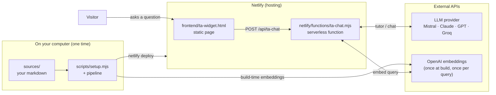
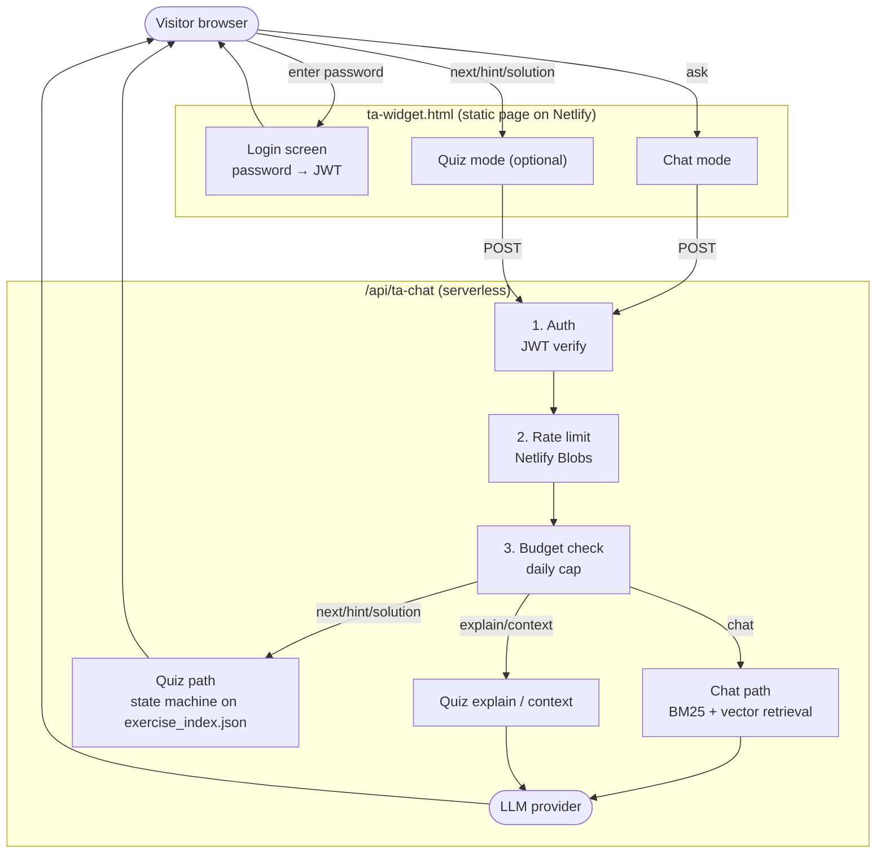

# MyTeachingPerroquet TA System

An embeddable chat widget that grounds an LLM's answers in your own content.
Drop in markdown — chapters, lecture notes, paper sections, manual pages —
and visitors can ask questions about it through a small chat box served by a
single Netlify function.

Originally built as a teaching assistant, it works equally well as a content
companion for a paper, book, manual, or documentation site.

The repo ships with a runnable demo (the first five chapters of Jerome K.
Jerome's *Three Men in a Boat*, 1889, public domain) so you can deploy it
end-to-end before replacing the content with your own.

## What you can build with it

- **Research paper companion.** Split a paper into sections, deploy a chat
  that answers reader questions grounded in the paper itself. The user clicks
  through to your paper from there.
- **Book or handbook companion.** Same idea, longer content. The included
  demo content is exactly this case.
- **Course teaching assistant.** The original use case. Adds an optional
  quiz mode that turns structured exercise banks into a stateful
  practice loop (next exercise, hints, solution, explain differently).
- **Documentation Q&A.** Point at a docs corpus, get a chat that answers
  questions about your product or library.

## How it works



The pipeline takes your markdown, splits it into retrievable chunks, embeds
them with OpenAI `text-embedding-3-small` (one-time, ~$0.01 per 1000 chunks),
and bundles the resulting JSON into the Netlify function. At query time the
function does BM25 + vector retrieval over the bundled corpus and streams the
LLM response back.

## Prerequisites

- Node.js 18 or later — [nodejs.org](https://nodejs.org)
- Netlify account and CLI: `npm install -g netlify-cli`
- API keys: a Mistral key (default) or Anthropic / OpenAI / Groq, **plus** an
  OpenAI key (always — for embeddings)

## Quick start

```bash
# From the MyTeachingPerroquet repository root:
cd phase3-ta-llm-system
npm install

# 1. Configure
node scripts/setup.mjs        # asks deployment type, language, colors, etc.
                              # writes frontend/ta-widget.html, data/course_config.json, .env.local

# 2. Fill in API keys in .env.local
#    OPENAI_API_KEY is required for step 3 (npm run vectors). MISTRAL_API_KEY (or
#    the equivalent for your chosen provider) is required at runtime. The vectors
#    step auto-loads .env.local, so the keys only need to live there.

# 3. Build the corpus (the demo content under sources/ runs as-is)
npm run preflight             # validate the layout
npm run chunk                 # split markdown → data/lecture_chunks.json
npm run transform             # process exercises if any → data/exercise_index.json
npm run rebuild               # merge → data/tutor_corpus.json
npm run vectors               # embed → data/tutor_vectors.json (calls OpenAI)

# 4. Deploy
netlify login
netlify init                  # "Create & configure a new site"
netlify deploy --prod
```

> Production env vars (the same `.env.local` keys, plus `JWT_SECRET` and
> `TA_CHAT_PASSWORD`) must also be set in the Netlify dashboard:
> *Site settings → Environment variables*. The `.env.local` file is for local
> dev with `netlify dev` and the `npm run vectors` build step only — it is
> not deployed.

If you accepted the default site URL during setup, the wizard leaves
`{{API_URL}}` unsubstituted in `frontend/ta-widget.html` — find-replace it
with `https://<your-site>.netlify.app/api/ta-chat` after the first deploy and
run `netlify deploy --prod` once more.

## Bringing your own content

Replace the contents of `sources/lectures/` with your own markdown, organized
into ordered section directories named `S1/`, `S2/`, ... — these are just
"sections" of your content (chapters, lectures, parts, modules). The pipeline
splits each file into chunks automatically.

For private course deployments, do this only in a private deploy clone or via
the gitignored course bundle produced by Phase 1/Phase 3. Do not commit private
course notes, raw dumps, student data, exams, answer keys, or generated
exercise banks to the public repository.

Exercises (under `sources/exercises/`) are optional. Skip the directory
entirely for a chat-only deployment; the pipeline handles its absence.

The format is documented in `sources/README.md`. In the full
MyTeachingPerroquet workflow, verified exercise JSON is copied from
`courses/<course_id>/phase2-output/full/` into `sources/exercises/`.

After updating content, re-run the pipeline and redeploy:

```bash
npm run preflight && npm run chunk && npm run transform && npm run rebuild && npm run vectors
netlify deploy --prod
```

## Environment variables

Set in the Netlify dashboard (Site settings → Environment variables) or in
`.env.local` for local dev with `netlify dev`.

The deployed TA uses two API paths:

| API path | What it does | Default | Required key |
|----------|--------------|---------|--------------|
| Embeddings | builds `tutor_vectors.json` and embeds each student query for retrieval | OpenAI `text-embedding-3-small` | `OPENAI_API_KEY` |
| Chat/query model | writes student-facing TA answers and quiz explanations | Mistral Medium via OpenAI-compatible API | `MISTRAL_API_KEY` |

These runtime APIs are separate from Phase 2 quiz generation and verification,
which can be run by Claude Desktop, Claude Code, Codex, or another
subscription-based agent before deployment. A common setup is: Claude Opus for
exercise generation/verification, OpenAI for embeddings, and Mistral Medium or
Claude Haiku for the deployed TA chat model.

| Variable | Required | Default | Purpose |
|----------|----------|---------|---------|
| `MISTRAL_API_KEY` | If using Mistral (default) | — | Mistral key from console.mistral.ai |
| `ANTHROPIC_API_KEY` | If using Claude | — | Anthropic key — also set `LLM_PROVIDER=anthropic` |
| `LLM_PROVIDER` | No | `openai` | `openai` covers Mistral / OpenAI / Groq via `LLM_BASE_URL`; `anthropic` switches to Claude SDK |
| `LLM_API_KEY` | No | auto | Overrides key lookup; defaults to `MISTRAL_API_KEY` or `ANTHROPIC_API_KEY` |
| `LLM_BASE_URL` | No | `https://api.mistral.ai/v1` | Provider endpoint — change for OpenAI / Groq |
| `MODEL_ID` | No | auto | `mistral-medium-latest` (default), `claude-haiku-4-5-20251001`, `gpt-4o-mini`, `llama-3.3-70b-versatile`, ... |
| `LLM_STREAM_USAGE` | No | auto | `on` / `off` — force the OpenAI `stream_options.include_usage` extension. Auto-enabled for OpenAI / Groq / Together / Fireworks; disabled for Mistral (rejects unknown params). |
| `OPENAI_API_KEY` | Yes | — | Always required — embeddings at build and at query time |
| `TA_CHAT_PASSWORD` | If `auth_required` | — | Shared access password |
| `JWT_SECRET` | Yes | — | Random string for session tokens — fail-closed if missing |
| `COURSE_ID` | Yes | `default` | Identifier used as Netlify Blob namespace |
| `DAILY_BUDGET_USD` | No | `10` | Per-day spend cap |
| `MAX_MESSAGES_PER_SESSION` | No | `50` | Per-session message limit |
| `MAX_REQUESTS_PER_MINUTE` | No | `5` | Global rate limit |
| `MAX_AUTH_ATTEMPTS` | No | `5` | Failed-login lockout threshold |
| `AUTH_LOCKOUT_MINUTES` | No | `15` | Lockout duration |
| `ALLOWED_ORIGIN` | Recommended | `*` | CORS allowed origin — the setup wizard writes your site URL here when you provide one. Default `*` lets any site use your password; the function logs a startup warning while it's still `*`. |
| `DATA_DIR` | No | `./data` | Path to bundled data files |

The function refuses to serve auth or chat endpoints if `JWT_SECRET` is unset
or left at the default; sessions would otherwise be trivially forgeable.

## Default TA Behavior

The default `course_ta` profile is intentionally short-form. The runtime system
prompt limits answers to about 200 words, 2-3 prose paragraphs, no bullets, no
numbered lists, no headings, and no emojis. It replies in the student's
language, cites course sources when useful, and gives hints instead of solving
homework outright.

This matters for exercise design. Past exams and rubrics can calibrate the
private quizbank, but quiz-visible questions should fit short chat turns.
Long essay or passage-analysis items should be shortened into case/application
questions or hidden from quiz mode.

## Provider options

The default chat/query model is **Mistral Medium 3** because it is cheap,
multilingual, and adequate for most content. Embeddings still use OpenAI by
default and require `OPENAI_API_KEY`. Switch the chat/query model by setting
the env vars below.

| Model | Provider | `MODEL_ID` | Input / output per M tokens |
|-------|----------|-----------|----------------------------|
| Mistral Medium 3 *(default)* | Mistral | `mistral-medium-latest` | $0.40 / $2.00 |
| Mistral Small 3 | Mistral | `mistral-small-latest` | $0.10 / $0.30 |
| Claude Haiku 4.5 | Anthropic | `claude-haiku-4-5-20251001` | $1.00 / $5.00 |
| Claude Sonnet 4.6 | Anthropic | `claude-sonnet-4-6` | $3.00 / $15.00 |
| GPT-4o mini | OpenAI | `gpt-4o-mini` | $0.15 / $0.60 |
| Llama 3.3 70B | Groq | `llama-3.3-70b-versatile` | $0.59 / $0.79 |
| Llama 3.1 8B | Groq | `llama-3.1-8b-instant` | $0.05 / $0.08 |

Test against your own content before committing — quality on dense technical
material varies more than benchmarks suggest. There is no universally "best"
model; pick the cheapest one whose answers are good enough for your readers.

**Switching providers:**

| Target | Variables to set |
|--------|------------------|
| Mistral default | `OPENAI_API_KEY`, `MISTRAL_API_KEY` |
| Claude Haiku runtime | `OPENAI_API_KEY`, `LLM_PROVIDER=anthropic`, `ANTHROPIC_API_KEY` |
| OpenAI runtime | `OPENAI_API_KEY`, `LLM_BASE_URL=https://api.openai.com/v1`, `LLM_API_KEY`, optional `MODEL_ID` |
| Groq runtime | `OPENAI_API_KEY`, `LLM_BASE_URL=https://api.groq.com/openai/v1`, `LLM_API_KEY`, optional `MODEL_ID` |

`LLM_PROVIDER=anthropic` selects the Anthropic SDK path. For Mistral, OpenAI,
Groq, and other OpenAI-compatible providers, leave `LLM_PROVIDER` unset or set
it to `openai`, then choose the endpoint with `LLM_BASE_URL`.

## Configuration file

`data/course_config.json` is read at function cold-start. The setup wizard
scaffolds a minimal version. Validate it with:

```bash
npx ajv-cli validate --spec=draft2020 -s schema/course_config_schema.json -d data/course_config.json
```

Notable fields:

The runtime fallback is `"course_ta"` if `prompt_profile` is omitted. The setup
wizard still asks which deployment type to scaffold.

```jsonc
{
  // "course_ta" (default) or "content_companion" — picks the system prompt persona
  "prompt_profile": "course_ta",

  // Free-text addendum appended to the system prompt.
  // Keep empty to preserve the runtime default.
  "assistant_persona": "",

  // Vocabulary expansion applied to assistant responses
  "abbreviations": { "OLS": "ordinary least squares" },

  // Domain terms boosted in the academic-signal detector (combined with built-ins)
  "academic_signals": ["regression", "estimator", "hypothesis"],

  // Appended to French responses when bilingual
  "terminology_fr": "OLS → MCO, unbiased → sans biais",

  // Section labels (metadata only)
  "course_topics": ["S1: Introduction", "S2: Core Concepts"],

  // Custom display labels for exercise type codes (quiz mode only)
  "question_type_labels": {
    "TF": { "fr": "Vrai ou Faux", "en": "True/False" }
  },

  // Hide exercise types from the quiz UI without removing them from data
  "hidden_question_types": [],

  "features": {
    "auth_required": true,
    "quiz_mode_enabled": false
  }
}
```

Use `"prompt_profile": "content_companion"` only when the deployment is not a
course TA, for example a paper, book, manual, or structured content companion.

## Architecture



## Full Workflow Use

For course deployments, treat this directory as Phase 3 of
MyTeachingPerroquet. Do not copy raw course dumps, exams, corrections, answer
keys, or quarantined material here. Copy only Phase 1 approved lectures and
Phase 2 verified exercises after the relevant approval gates are marked
approved.

## Troubleshooting

| Symptom | Likely cause | Fix |
|---------|-------------|-----|
| Function returns 500 | Missing env vars | Netlify dashboard → site → Functions → click function → invocation logs |
| "Session expired" immediately | `JWT_SECRET` unset | Set it to a random string |
| Visitors can't log in | `TA_CHAT_PASSWORD` unset | Set it, or set `features.auth_required: false` for open access |
| Quiz mode shows nothing | No exercises bundled, or `COURSE_ID` mismatch | Re-run pipeline; ensure `COURSE_ID` env var matches what was set during build |
| Chat doesn't answer | Wrong / missing LLM key | Default Mistral: check `MISTRAL_API_KEY`. Anthropic: check `ANTHROPIC_API_KEY` and `LLM_PROVIDER=anthropic`. Logs in Netlify Functions tab. |
| `netlify dev` fails | Missing `.env.local` | Copy `.env.example` to `.env.local` |
| Site shows blank page | `{{API_URL}}` not replaced after first deploy | Find-replace it in `frontend/ta-widget.html`, redeploy |
| Widget refuses iframe embedding | Default `frame-ancestors 'self'` policy | Edit `netlify.toml` to allow your embedding origin |

## Privacy

Visitor questions and assistant responses are processed by three systems:

- **The configured LLM provider and OpenAI** (always, for embeddings) — both
  see the user's question and the retrieved corpus context. Review their
  data-retention policies if reader anonymity matters.
- **Netlify Functions logs** — every request and response is visible to anyone
  with access to the Netlify dashboard for the site.
- **Netlify Blobs** — the function persists per-interaction records (the
  user's question, the assistant's response, retrieval metadata, and any
  feedback the user gives) into a Blobs namespace tied to `COURSE_ID`. These
  are kept for as long as the Netlify site exists; delete the Blobs store
  manually when retiring a deployment.

Set `features.auth_required: true` (the default for course deployments) so
only authenticated users can submit queries that get logged.

## License

MIT — see `LICENSE`.

The demo content (`sources/lectures/` chapters from *Three Men in a Boat*) is
public-domain text from Project Gutenberg (eBook #308); see
`sources/SOURCES.md` for attribution.
